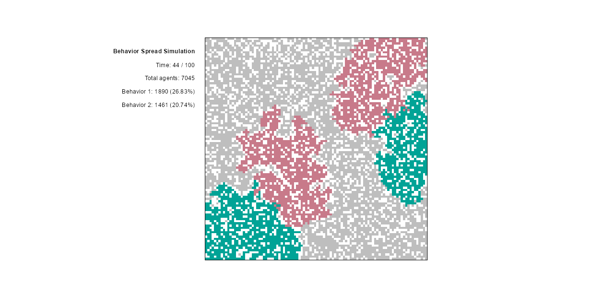

# Simulate behavior spread in a social network

This script simulates the spread of behaviors within a social network, represented as a grid. Each cell in the grid can be empty, contain an unaffected agent, or contain an agent influenced by one of several behaviors. The simulation models how behaviors spread through social influence, with agents adopting behaviors based on specific probabilities. It visualizes the dynamics of behavior spread, including adoption and switching behaviors, across a defined number of steps. Parameters such as the probabilities for adopting or switching behaviors, the initial density of agents, and the number of origin points for behaviors are configurable, enabling exploration of different scenarios of social influence and behavior dynamics.

## License
This code is licensed under the MIT license found in the LICENSE file in the root directory of this source tree.

## Usage
To run the simulation, you will need R installed on your computer. You can then execute the script in an R environment. The main function `simulate_behavior_spread(tlength)` takes one argument:
- `tlength`: Total number of time steps the simulation will run.

The script initializes with default parameters for the simulation, but you can modify them as needed to explore different dynamics. 

### Parameters
- `grid_size`: Size of the grid representing the social network.
- `tlength`: Total number of simulation steps.
- `num_behaviors`: Total number of distinct behaviors that can spread.
- `prob_unaffected`: Probability of an unaffected agent adopting a behavior.
- `prob_affected`: Probability of an affected agent switching to a different behavior.
- `initial_agents_density`: Initial agent density within the grid.
- `origins_per_behavior`: Number of origin points for each behavior.
- `color_map`: Color map for visualizing agent states.

## Installation
No installation is required beyond having R and the necessary libraries. To run the script, simply clone this repository or download the script file and execute it within your R environment.
